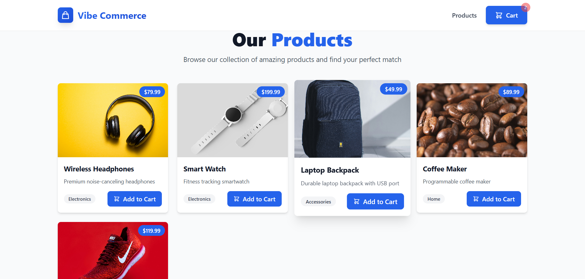
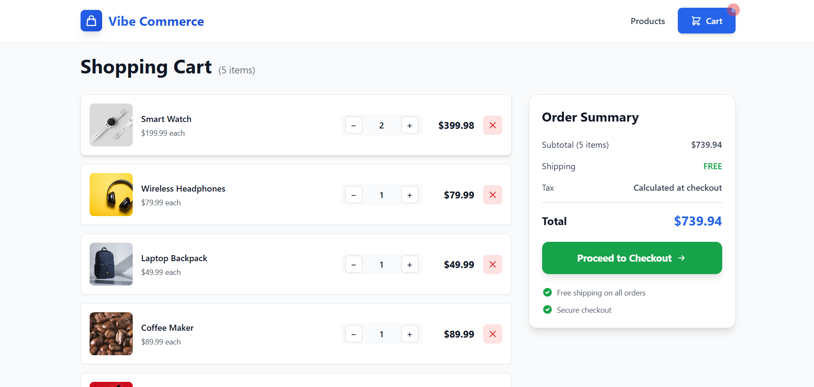
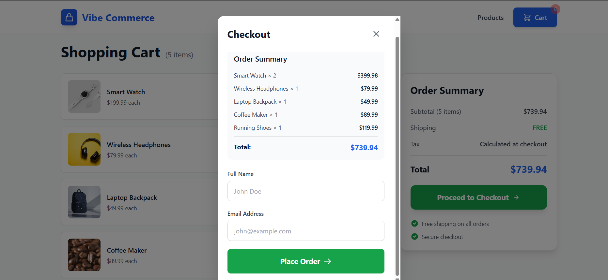
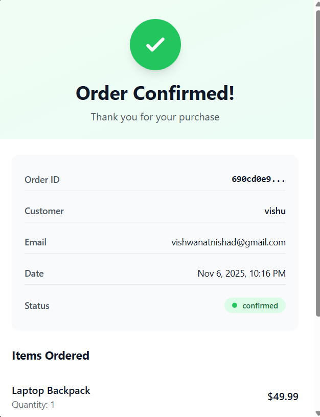

---

# 🛍️ Vibe Commerce – Shopping Cart Application


A modern **full-stack e-commerce shopping cart** application built with **React + Vite**, **Express**, **MongoDB**, and **Tailwind CSS** for the **Vibe Commerce** screening assignment.

---

## 🚀 Features

* 🧾 **Product Catalog** — Browse curated products
* 🛒 **Shopping Cart** — Add, remove, and update quantities
* 💾 **Persistent Storage** — Cart data saved in MongoDB
* 💳 **Mock Checkout** — Complete purchase flow with form submission
* 🧾 **Order Confirmation** — Receipt modal with order details
* 📱 **Responsive Design** — Mobile-friendly UI using Tailwind CSS
* ⚡ **Real-time Updates** — Live cart count in navigation
* 🛠️ **Error Handling** — Comprehensive messages and loading states

---

## 🛠️ Tech Stack

### Frontend

* **Vite** 6.x – Next-gen build tool for React
* **React** 18.2.0 – Component-based UI library
* **React Router DOM** 6.20.0 – SPA routing
* **Tailwind CSS** 3.4.1 – Utility-first styling
* **Axios** 1.6.0 – HTTP client
* **PostCSS & Autoprefixer** – CSS processing

### Backend

* **Node.js** – Runtime environment
* **Express.js** – Web framework
* **MongoDB + Mongoose** – Database & ODM
* **CORS** – Cross-origin resource sharing
* **dotenv** – Environment configuration

---

## 📁 Project Structure

```
vibe-commerce-cart/
├── backend/
│   ├── config/
│   │   └── db.js
│   ├── models/
│   │   ├── Product.js
│   │   ├── Cart.js
│   │   └── Order.js
│   ├── controllers/
│   │   ├── productController.js
│   │   ├── cartController.js
│   │   └── checkoutController.js
│   ├── routes/
│   │   ├── productRoutes.js
│   │   ├── cartRoutes.js
│   │   └── checkoutRoutes.js
│   ├── server.js
│   ├── .env
│   └── package.json
│
├── frontend/
│   ├── public/
│   ├── src/
│   │   ├── components/
│   │   │   ├── ProductCard.jsx
│   │   │   ├── CartItem.jsx
│   │   │   ├── CheckoutModal.jsx
│   │   │   └── ReceiptModal.jsx
│   │   ├── pages/
│   │   │   ├── Products.jsx
│   │   │   └── Cart.jsx
│   │   ├── services/
│   │   │   └── api.js
│   │   ├── App.jsx
│   │   ├── main.jsx
│   │   └── index.css
│   ├── vite.config.js
│   ├── tailwind.config.js
│   ├── postcss.config.js
│   └── package.json
└── README.md
```

---

## 📋 Prerequisites

* **Node.js ≥ v16** – [Download](https://nodejs.org/)
* **MongoDB ≥ v4.4** – [Download](https://www.mongodb.com/try/download/community)
* **npm / yarn**
* **Git** – [Download](https://git-scm.com/)

---

## ⚙️ Installation & Setup

### 1️⃣ Clone the Repository

```bash
git clone <your-repo-url>
cd vibe-commerce-cart
```

### 2️⃣ Backend Setup

```bash
cd backend
npm install
```

Create `.env` file:

```env
PORT=5000
MONGO_URI=mongodb://localhost:27017/vibecommerce
```

### 3️⃣ Frontend Setup (Vite + React)

```bash
cd ../frontend
npm install
```

> Tailwind CSS is already configured for Vite.

---

## 🚀 Running the Application

### Start MongoDB

**Windows**

```bash
net start MongoDB
```

**macOS**

```bash
brew services start mongodb-community
```

**Linux**

```bash
sudo systemctl start mongodb
```

### Start Backend

```bash
cd backend
npm run dev
```

→ Backend runs on `http://localhost:5000`

### Start Frontend (Vite)

```bash
cd frontend
npm run dev
```

→ Frontend runs on `http://localhost:5173`

---

## 🔌 API Endpoints

### 🧩 Products

| Method | Endpoint             | Description        |
| ------ | -------------------- | ------------------ |
| GET    | `/api/products`      | Fetch all products |
| POST   | `/api/products/seed` | Seed mock products |

### 🛒 Cart

| Method | Endpoint        | Description     |
| ------ | --------------- | --------------- |
| GET    | `/api/cart`     | Get cart items  |
| POST   | `/api/cart`     | Add item        |
| PUT    | `/api/cart/:id` | Update quantity |
| DELETE | `/api/cart/:id` | Remove item     |
| DELETE | `/api/cart`     | Clear cart      |

### 💳 Checkout

| Method | Endpoint        | Description                     |
| ------ | --------------- | ------------------------------- |
| POST   | `/api/checkout` | Process order and create record |

---

## 💾 Database Schemas

**Product**

```js
{ name, price, description, image, category, stock, timestamps: true }
```

**Cart**

```js
{ userId, items: [{ productId, name, price, quantity, image }], totalPrice, timestamps: true }
```

**Order**

```js
{ customerName, customerEmail, items, totalAmount, orderStatus, orderDate, timestamps: true }
```

---

## 🎨 Architecture Overview

### Frontend

* **Vite + React** — lightning-fast builds
* **Tailwind CSS** — modern responsive UI
* **React Router** — SPA navigation
* **Axios API Layer** — centralized requests
* **Hooks (`useState`, `useEffect`)** — state management

### Backend

* **MVC Pattern** — separation of concerns
* **RESTful API** — clear endpoints
* **Mongoose ODM** — schema validation
* **CORS Enabled** — smooth communication
* **Error Handling** — structured responses

---

## 📸 Screenshots

| Page               | Preview                                 | Description                  |
| ------------------ | --------------------------------------- | ---------------------------- |
| **Products Page**  |  | Browse and add items to cart |
| **Shopping Cart**  |          | Manage items and quantities  |
| **Checkout Modal** |  | Submit customer info         |
| **Order Receipt**  |    | View order confirmation      |

---

## 🧪 Testing the App

1. View product grid on home page
2. Add product(s) to cart
3. Open cart to view items
4. Adjust quantities or remove items
5. Proceed to checkout and submit form
6. View order receipt modal

---

## 🐛 Troubleshooting

**Port Already in Use**

```bash
npx kill-port 5173
npm run dev -- --port=5174
```

**MongoDB Connection Error**

```bash
mongo --version
net start MongoDB
```

**Tailwind CSS Not Working**

```bash
rm -rf node_modules/.cache
npm run dev
```

→ Then hard-refresh browser (**Ctrl + Shift + R**)

**npm install Fails**

```bash
npm cache clean --force
rm -rf node_modules package-lock.json
npm install
```

---

## 🔮 Future Enhancements

* [ ] JWT Authentication
* [ ] Multi-User Cart Support
* [ ] Stripe / PayPal Integration
* [ ] Product Filtering & Search
* [ ] Category Browsing
* [ ] Reviews & Ratings
* [ ] Wishlist Functionality
* [ ] Order History Page
* [ ] Admin Dashboard
* [ ] Email Notifications
* [ ] Product Image Uploads
* [ ] Discount Codes / Coupons
* [ ] Inventory Management

---

## 🤝 Contributing

This project was created for the **Vibe Commerce Screening Assignment**.
You’re welcome to fork or extend it for learning purposes.

---

## 📝 License

Released under the **MIT License** — free for personal & educational use.

---

## 👨‍💻 Author

**Vishwanath Nishad**

* GitHub → [@vishu1803](https://github.com/vishu1803)
* Email → [your.email@example.com](mailto:your.email@example.com)

---

## 🙏 Acknowledgments

* Vibe Commerce for the assignment
* React, Vite & Tailwind CSS communities
* MongoDB & Express documentation

---

**Built with ⚡ Vite + ❤️ by Vishwanath Nishad for the Vibe Commerce Screening Assignment**

---


